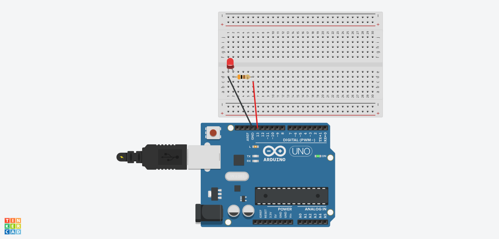

# Arduino Job02

En fonction des informations suivantes, calculer les valeurs nécessaires à la résistance pour obtenir un courant de 10 milliampères à travers la LED.
➔ La tension de seuil de la LED est de 2 volts
➔ La tension d’alimentation de l’Arduino est de 5 volts
➔ Le courant maximal que peut supporter la LED est de 20 milliampères
➔ Le port de sortie de l’Arduino peut fournir une tension de 5 volts et un courant max de 40 milliampères

loi d'ohm:
R = U/I

La tension disponible à travers la résistance est la différence entre la tension d'alimentation de l'Arduino et la tension de seuil de la LED. Donc :
UR=Ualim−ULED=5V−2V=3V

I est le courant désiré.
I = 0.01A

R = 3/0.01
R = 300 Ohm

